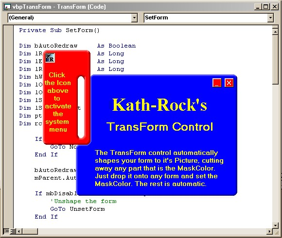



## TransForm your Form \(Form Transparency\)

### Description

This UserControl will take the existing Picture on any form and cut out the form wherever the MaskColor is found. This method is MUCH quicker than the pixel by pixel region creation I've seen on several sites. Features an AutoDrag property to allow the form to be dragged without a titlebar. Also features a PopupSysMenu method to activate the form's system menu at specified coordinates. No need to remove your Titlebar, TransForm cuts that out too, but it's still visible on the taskbar if you want. Comes with full source code and a demo project.
 
### More Info
 

             |
---                |---
**Submitted On**   |2001-11-24 19:07:36
**By**             |[Rocky Clark \(Kath\-Rock Software\)](https://github.com/Planet-Source-Code/PSCIndex/blob/master/ByAuthor/rocky-clark-kath-rock-software.md)
**Level**          |Intermediate
**User Rating**    |4.9 (79 globes from 16 users)
**Compatibility**  |VB 6\.0
**Category**       |[Custom Controls/ Forms/  Menus](https://github.com/Planet-Source-Code/PSCIndex/blob/master/ByCategory/custom-controls-forms-menus__1-4.md)
**World**          |[Visual Basic](https://github.com/Planet-Source-Code/PSCIndex/blob/master/ByWorld/visual-basic.md)
**Archive File**   |[TransForm\_3723611242001\.zip](https://github.com/Planet-Source-Code/rocky-clark-kath-rock-software-transform-your-form-form-transparency__1-29189/archive/master.zip)

